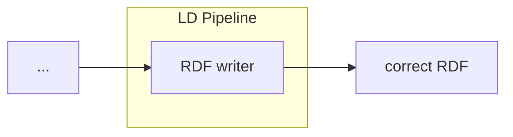

# RDF Adapter

<b>LDIO Component Name:</b> <i>`Ldio:RdfAdapter`</i> see [reference guide](https://openldes.github.io/Linked-Data-Interactions/ldio/ldio-adapters/ldio-rdf-adapter)  
<b>Apache Nifi Component Name:</b> there is no Apache Nifi variant created within the frame of VSDS

As the most basic Adapter of the LDI Core Building Blocks, the RDF Adapter will take in an RDF string and convert it 
into an internal Linked Data model.  

## Notes

This Adapter only supports valid RDF mime types

 

