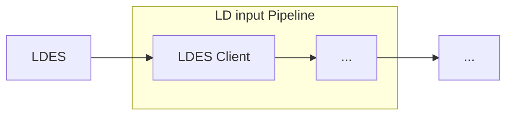

# LDES Client

<b>LDIO Component Name:</b> <i>`Ldio:LdioLdesClient`</i> see [reference guide](https://openldes.github.io/Linked-Data-Interactions/ldio/ldio-inputs/ldio-ldes-client)  
<b>Apache Nifi Component Name:</b> <i>`Ldio:LdioLdesClient`</i> see [reference guide](https://s01.oss.sonatype.org/#nexus-search;gav~be.vlaanderen.informatievlaanderen.ldes.ldi.nifi~ldes-client-processor)

 

The <b>LDES Client</b> stands as a critical component of the pipeline, arguably the most pivotal. The LDES Client is responsible for consuming members from an existing LDES, subsequently facilitating their smooth progression through the LDIO. The LDES Client contains the functionality to replicate and synchronize an LDES, and to persist its state for that process.

This is achieved by configuring the processor with an initial fragment URL. When the processor is triggered, the fragment will be processed, and all relations will be added to the (non-persisted) queue.A queue that accepts new fragments to process is maintained as long as the processor runs. The processor also keeps track of the mutable and immutable fragments already processed.

It will be ignored when an attempt is made to queue a known immutable fragment. Fragments in the mutable fragment store will be queued when they're expired. Should a fragment be processed from a stream that does not set the max-age in the Cache-control header, a default expiration interval will be used to set an expiration date on the fragment.

Processed members of mutable fragments are also kept in state. They are ignored if presented more than once.

Within a fragment, members can be ordered based on a timestamp. The path to this timestamp has to be configured. If this path is missing, the members are ordered randomly.

 

The [LDES CLIENT](https://github.com/OpenLDES/Linked-Data-Interactions) is designed for replication and synchronisation, meaning the client can retrieve members of an LDES but also checks regularly if new members are added and fetch them, allowing data consumers to stay up to date with the dataset.

To understand the functioning of an LDES client, it is important to understand how LDESes are published on the Web. The [Linked Data Fragments](https://linkeddatafragments.org/specification/linked-data-fragments/) principle is utilised for publishing an LDES, meaning that the data is published in one or more fragments and meaningful semantic links are created between these fragments. This approach facilitates clients to follow these links and discover additional data. However, the critical aspect for the LDES client is the notion of mutable and immutable fragments. When publishing an LDES stream, a common configuration is to have a maximum number of members per fragment. Once a fragment surpasses this limit, it is regarded as immutable, and a **'Cache-control: immutable'** cache header is added to the fragment to signify this. This information is crucial for the LDES client since it only needs to retrieve an immutable fragment once, while mutable fragments must be regularly polled to identify new members.

## Linked Data Interactions

The LDES client component is written in Java and available as an [SDK](https://github.com/OpenLDES/Linked-Data-Interactions/tree/main/ldi-core/ldes-client) in the Linked Data Interactions repository. More information about Linked Data Interactions can be found [here](https://openldes.github.io/Linked-Data-Interactions/).

The LDES Client contains the functionality to replicate and synchornise an LDES, and to persist its state for that process.

This is achieved by configuring the processor with an initial fragment URL. When the processor is triggered, the fragment will be processed, and all relations will be added to the (non-persisted) queue.

As long as the processor runs, a queue that accepts new fragments to process is maintained. The processor also keeps track of the mutable and immutable fragments already processed.

It will be ignored when an attempt is made to queue a known immutable fragment. Fragments in the mutable fragment store will be queued when they're expired. Should a fragment be processed from a stream that does not set the max-age in the Cache-control header, a default expiration interval will be used to set an expiration date on the fragment.

Processed members of mutable fragments are also kept in state. They are ignored if presented more than once.

Within a fragment, members can be ordered based on a timestamp. The path to this timestamp has to be configured. If this path is missing, the members are ordered randomly.

