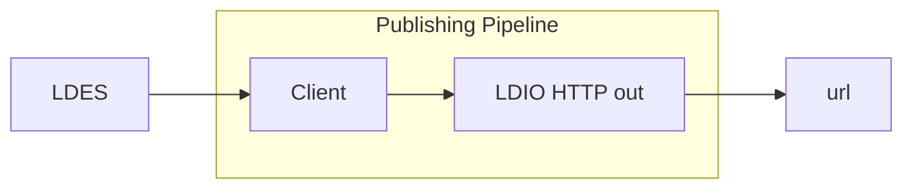

# HTTP Out

<b>LDIO Component Name:</b> <i>`Ldio:HttpOut`</i> see [reference guide](https://openldes.github.io/Linked-Data-Interactions/ldio/ldio-outputs/ldio-http-out)  
<b>Apache Nifi Component Name:</b> <i>`InvokeHTTP` </i> see [Apache Nifi reference guide](https://nifi.apache.org/docs/nifi-docs/components/org.apache.nifi/nifi-standard-nar/1.23.2/org.apache.nifi.processors.standard.InvokeHTTP/index.html)

 

The LDIO HTTP Out is a basic Http Client that will send the given Linked Data model to a target url. This pipeline component is responsible for sending harvested LDES members to an external destination (url) using the HTTP (Hypertext Transfer Protocol). HTTP is the foundational protocol used for transmitting data over the internet, primarily used for loading web pages in a browser, but it's also widely utilized in various other types of network communication.

