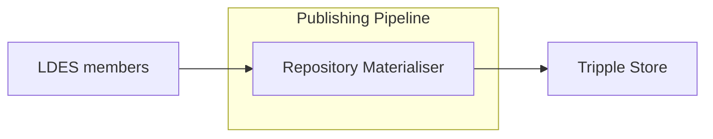

# Repository Materialiser

<b>LDIO Component Name:</b> <i>`Ldio:RepositoryMaterialiser`</i> see [reference guide](https://openldes.github.io/Linked-Data-Interactions/ldio/ldio-outputs/ldio-repository-materialiser)  
<b>Apache Nifi Component Name:</b> <i>`RepositoryMaterialiser` </i> see [reference guide](https://s01.oss.sonatype.org/#nexus-search;gav~be.vlaanderen.informatievlaanderen.ldes.ldi.nifi~nifi-rdf4j-repository-materialisation-processor~~~~kw,versionexpand)

 

The repository materialiser is used to materialise an LDES stream into a triplestore.
Any triplestore that supports the RDF4J remote repository API can be used.

### Batching

To increase the performance of this materialiser, members will be committed in batch to the triple store. However, it's
important to notice that this can have an impact on the data integrity. First of all, there could be a delay, with a
maximum delay of the configured batch timeout, when the triple store will be up-to-date. Secondly, if something goes
wrong halfway of a batch, all the members in that batch will not be committed to triple story and thus will be gone.

So the more important data integrity is, the lower the `batch-size` and `batch-timeout` should be configured. If a more
performant repository materialiser is desired, `batch-size` and `batch-timeout` should be configured somewhat higher. 