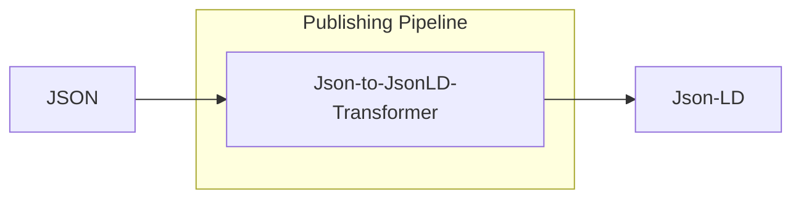

# Json To JsonLd Transformer

<b>LDIO Component Name:</b> <i>`Ldio:JsonToLdAdapter`</i> see [reference guide](https://openldes.github.io/Linked-Data-Interactions/ldio/ldio-adapters/ldio-json-to-json-ld)  
<b>Apache Nifi Component Name:</b> <i>`
Json to Json LD Processor` </i> see [reference guide](https://s01.oss.sonatype.org/#nexus-search;gav~be.vlaanderen.informatievlaanderen.ldes.ldi.nifi~json-to-ld-processor)

The json-to-ld-adapter receives json messages and adds a linked data context to transform the messages to json-ld. The JSON-to-LD Adapter is designed to bridge the gap between conventional JSON messages and the more semantically rich JSON-LD (JSON for Linked Data). At its core, this adapter takes incoming JSON messages, which are widely used for their simplicity and flexibility in data interchange, and enhances them by appending a linked data context. 

