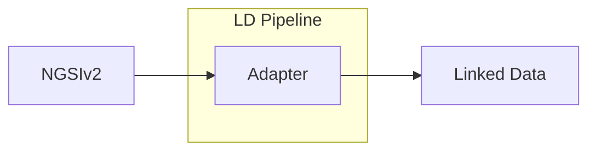

# NGSI v2 to LD Adapter

<b>LDIO Component Name:</b> <i>`Ldio:NgsiV2ToLdAdapter`</i> see [reference guide](https://openldes.github.io/Linked-Data-Interactions/ldio/ldio-adapters/ldio-ngsiv2-to-ld)  
<b>Apache Nifi Component Name:</b> <i>`
NgsiV2ToLdAdapter Processor` </i> see [reference guide](https://s01.oss.sonatype.org/#nexus-search;gav~be.vlaanderen.informatievlaanderen.ldes.ldi.nifi~ngsiv2-to-ld-processor~~~~kw,versionexpand)

This adapter will transform a [NGSI V2] input into [NGSI LD]. NGSI v2 is intended to manage the entire lifecycle of context information, including updates, queries, registrations, and subscriptions.

NGSI v2 is a technical standard of Fiware designed for managing the context information lifecycle within smart solutions, particularly those related to smart cities or the Internet of Things (IoT). Context information refers to any data that can be used to characterize the state of an entity such as a device, user, or environment. The purpose of NGSI v2 is to provide a uniform way to handle this data, making it easier to develop, deploy, and interoperate IoT and smart applications.

NGSI-LD represents an evolution from NGSI v2, by integrating linked data principles to improve interoperability and data sharing in IoT and smart environments. While NGSI v2 focuses on managing the lifecycle of context information through updates, queries, registrations, and subscriptions in a straightforward manner, NGSI-LD adds a layer of semantic richness and structure. It leverages standardized vocabularies and ontologies, enabling systems to not only exchange data but to understand its meaning across diverse domains. This is achieved through a graph-based representation of context information, allowing for complex relationships and structures to be efficiently navigated and interpreted. Key advancements include the use of property-of-property annotations and the management of temporal data, enhancing the standard’s capability to handle sophisticated scenarios and offering a comprehensive solution for data integration and interpretation in smart applications.

[Jackson] is used to first deserialize the input to java objects which can then be serialized to the LD format.

 

## Notes

The algorithm applies several deviations from the standard formats. These deviations are:

1. The observedAt attribute is added to every property,
   its value is determined by the dateObserved attribute of the input.
2. The timestamp attribute of a metadata property normally determines the observedAt property but is ignored in this algorithm.

[NGSI V2]: https://fiware.github.io/specifications/ngsiv2/stable/
[NGSI LD]: https://ngsi-ld-tutorials.readthedocs.io/en/latest/
[Jackson]: https://github.com/FasterXML/jackson