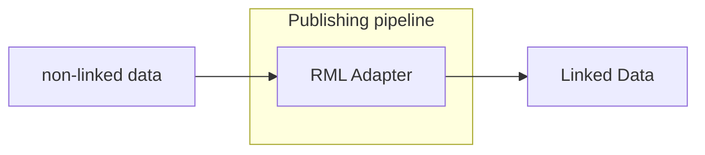

# RML Adapter

<b>LDIO Component Name:</b> <i>`Ldio:RmlAdapter`</i> see [reference guide](https://openldes.github.io/Linked-Data-Interactions/ldio/ldio-adapters/ldio-rml-adapter)  
<b>Apache Nifi Component Name:</b> There is currently no RML adapter processor for Apache Nifi. 

 

The RML Adapter allows a user to transform a non-LD object (json/CSV/XML) to an RDF object using [RML]. This is done by providing a [RML] mapping file. An RML mapping file is essentially a blueprint that defines how elements within the source data (whether they be JSON properties, CSV columns, or XML elements) correlate with RDF triples' subjects, predicates, and objects. These triples form the backbone of RDF's graph-based model, representing semantic relationships between entities in a way that is both machine-readable and semantically rich.

However, as RML is written in RDF, it can be challenging for a new user to create a new mapping.

That's where [YARRRML] comes into play. Along with the online editor [Matey], it's easy to build one's own mapping and then export it into RML.

[RML]: https://rml.io/specs/rml/
[YARRRML]: https://rml.io/yarrrml/spec/
[Matey]: https://rml.io/yarrrml/matey/

