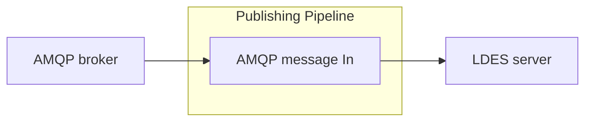

# AMQP broker message In

<b>LDIO Component Name:</b> <i>`Ldio:AmqpIn`</i> see [reference guide](https://openldes.github.io/Linked-Data-Interactions/ldio/ldio-inputs/ldio-amqp-in)  
<b>Apache Nifi Component Name:</b> <i>`ConsumeAMQP` </i> see [Apache Nifi reference guide](https://nifi.incubator.apache.org/docs/nifi-docs/components/org.apache.nifi/nifi-amqp-nar/1.23.2/org.apache.nifi.amqp.processors.ConsumeAMQP/index.html)

 

Consumes AMQP Messages from an AMQP Broker using the AMQP protocol. Each message that is received from the AMQP Broker will be emitted downstream the pipeline.

The LDIO AMQP In listens to messages from
an [AMQP 1.0 queue](https://www.amqp.org/resources/specifications).

