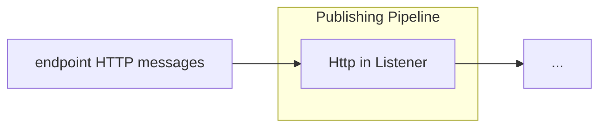

# HTTP In

<b>LDIO Component Name:</b> <i>`Ldio:LdioHttpIn`</i> see [reference guide](https://openldes.github.io/Linked-Data-Interactions/ldio/ldio-inputs/ldio-http-in)  

<b>Apache Nifi Component Name:</b> <i>`InvokeHTTP`</i> see [Apache Nifi reference guide](https://nifi.apache.org/docs/nifi-docs/components/org.apache.nifi/nifi-standard-nar/1.17.0/org.apache.nifi.processors.standard.InvokeHTTP/index.html)

 

The LDIO HTTP In is a basic HTTP Listener. This component listens for HTTP messages at the endpoint `http://{hostname}:{port}/{pipeline name}`.

It supports processing input in various content types, including XML (text/xml, application/xml), JSON (application/json), and RDF (text/turtle, application/ld+json, application/n-quads, application/n-triples, application/rdf+xml).

The expected output of this component is also in similar formats, supporting XML, JSON, and RDF content types.

