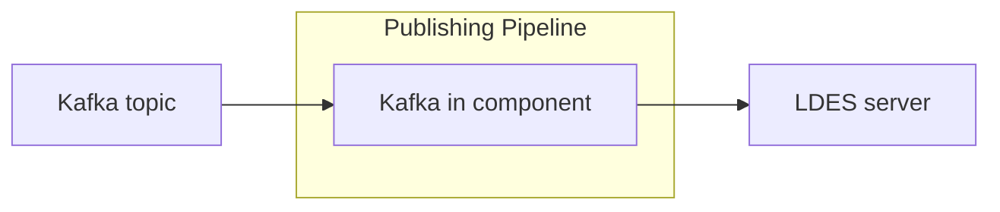

# Kafka In

<b>LDIO Component Name:</b> <i>`Ldio:LdioKafkaIn`</i> see [reference guide](https://openldes.github.io/Linked-Data-Interactions/ldio/ldio-inputs/ldio-kafka-in)  
<b>Apache Nifi Component Name:</b> <i>`ConsumeKafka`</i> see [Apache Nifi reference guide](https://nifi.apache.org/docs/nifi-docs/components/org.apache.nifi/nifi-kafka-2-0-nar/1.24.0/org.apache.nifi.processors.kafka.pubsub.ConsumeKafka_2_0/index.html)

 

The LDIO Kafka In component is vital to the Publishing Pipeline, specifically designed to interact with Kafka, a distributed event streaming platform. This component is responsible for listening to messages from a specified [kafka topic](https://kafka.apache.org), which is crucial in integrating with an LDES server.

