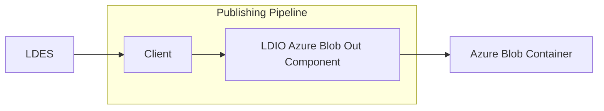

# LDIO Azure Blob Out

<b>LDIO Component Name:</b> <i>`Ldio:AzureBlobOut`</i> see [reference guide]()  
<b>Apache Nifi Component Name:</b> <i>`PutAzureBlobStorage` </i> see [Apache Nifi reference guide](https://nifi.apache.org/docs/nifi-docs/components/org.apache.nifi/nifi-azure-nar/1.24.0/org.apache.nifi.processors.azure.storage.PutAzureBlobStorage/index.html)

 

The LDIO Azure Blob Out writes out messages to an Azure Blob Container. Messages can be written in any format supported by Apache Jena or in JSON format.

{.warning}
For the json format it is necessary to have a URI which holds the context.

